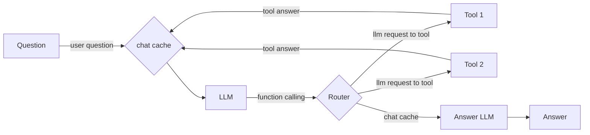
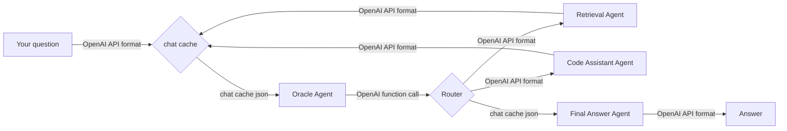

# Agentic Approach

> **Goal:** Aggregate information collected by specialized pipelines and apply it to solve user problems.

---

## 1) What is an Agent LLM?

An **Agent LLM** is a pattern where a language model does more than generate text: it also **plans actions and uses external tools** (APIs, databases, applications) to achieve a goal. Unlike a plain LLM that only replies to prompts, an agent **reasons, acts, and iterates** in a loop until the task is complete.

**Benefits**

* Autonomously completes multi-step tasks, not just single responses  
* Integrates with tools (APIs, databases, apps) for concrete actions  
* Adapts dynamically through reasoning and feedback loops  
* Scales productivity by reducing the need for human micromanagement  

---

## 2) Agent Composition

**Agent composition** is a pattern where a user’s query is **broadcast to all available tools**. Each tool returns its output, and the LLM simply **summarizes the combined results**—without reasoning or selective planning.




## 3) Agentic System Composition

Agentic system composition adds reasoning and selective tool use. A central Oracle Agent interprets the question, uses a Router to choose the necessary specialized agents (e.g., retrieval, code assistant), gathers their outputs, and then forwards them to a Final Answer Agent, which integrates everything into the final response for the user.



## 4) Agent Selection

To enable tool selection, each available agent must be described with a standardized function schema JSON template. This metadata helps the Oracle Agent understand what each agent can do.

```json
{
  "type": "function",
  "function": {
    "name": "agent_name",
    "description": "Extensive and precise description of the agent's purpose and application.",
    "parameters": {
      "type": "object",
      "properties": {
        "query": {
          "type": "string",
          "description": "The user query to process"
        }
      },
      "required": ["query"]
    }
  }
}
```

The Oracle Agent receives the JSON definitions for all agents, decides which ones to call, and formulates the queries to them. After gathering sufficient information—or reaching a maximum query limit—it delegates to the Final Answer Agent, which consolidates the results and produces the final response.


## 5) Simplified OpenAI Format

All communication between agents follows a simplified OpenAI Chat Completions JSON format on endpoint:

> /chat/completions

* Request:
```json
{
  "model": "agent_name",
  "messages": [
    {
      "role": "user",
      "content": "..."
    }
  ],
  "tools": "{...}"
}
```

* Response:
```json
{
  "id": "0",
  "object": "chat.completion",
  "created": 1694800000,
  "model": "agent_name",
  "choices": [
    {
      "index": 0,
      "message": {
        "role": "assistant",
        "content": "agent_answer"
      },
      "tool_calls": []
      "finish_reason": "stop"
    }
  ]
}

```
## 6) Chat cache format
```json
{

  "messages": [
    {
      "role": "user",
      "content": "..."
    },
    {
      "role": "tool 1",
      "content": "..."
    },
    {
      "role": "tool 1",
      "content": "..."
    },
  ]
}
```