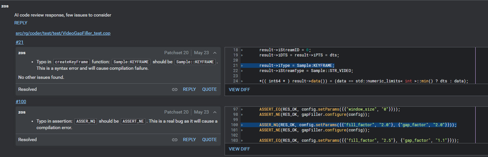
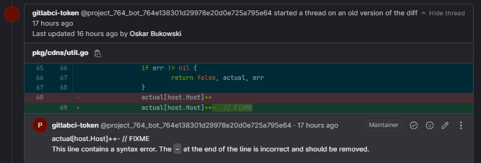
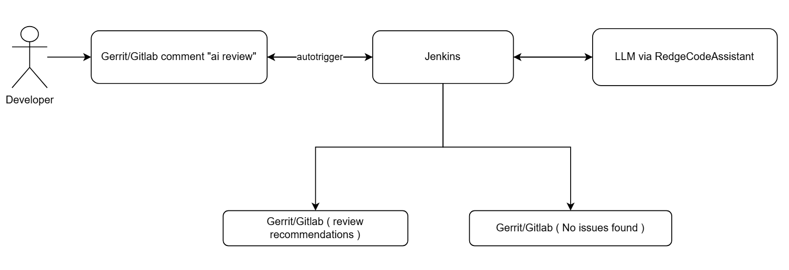
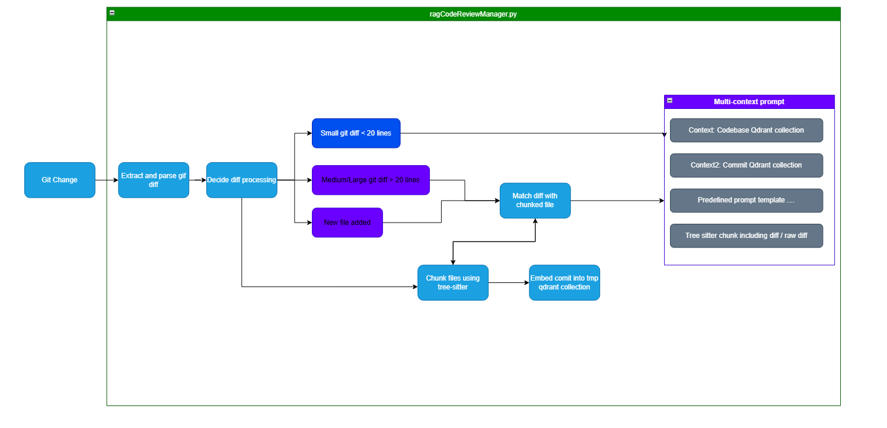

# 🤖 AI-Powered Code Review Flow

CurrentVersion: **Stage2 (zos C++ repository)** / **Stage1 (Other)**


> **Summary**  
> To enhance the efficiency and consistency of our code review process, we have integrated an AI-assisted review mechanism into our Gerrit/GitLab workflow.  
> This system enables developers to trigger an automated code review using an LLM, with results seamlessly posted back to Gerrit/GitLab for peer validation.

---

## 📂 Currently Supported Repositories

- **Gerrit**
  - `atds/drm/zos/red-galaxy/core` (Stage2)

- **Gerrit DSB**
  - `dsb/dataplane` (Stage1)

- **GitLab**
  - `rg-libs-go` (Stage1)
  - `rg-cdn-scaler-agent-go` (Stage1)
  - `rg-xk6` (Stage1)
  - `rm-origin-vod-go` (Stage1)
  - `rm-cdns-go` (Stage1)

ℹ️ *If you need support for another repository, please contact **@dum-zos** to provide the relevant configuration.*

---

## 🔄 Workflow Details

### 1. Developer-Initiated AI Review
- Once a developer pushes a commit and deems it ready for review, they can trigger an AI review by commenting:

```text
  ai review
```

* This comment (case-insensitive) is monitored by **Jenkins Gerrit Trigger Plugin** / **Jenkins GitLab Plugin** + **GitLab Webhook**.

> ⚠️ **Important**
> Make sure your code change is **clean** (resolved conflicts, rebased if possible, no Gerrit/GitLab lock).
> Otherwise, the AI review may fail.

---

### 2. Jenkins Pipeline Execution

* Jenkins detects the `ai review` comment and triggers a dedicated pipeline:

  * [zos-jenkins.redlabs.pl/job/dum-zos-ai-code-review](https://zos-jenkins.redlabs.pl/job/dum-zos-ai-code-review/)
  * [zos-jenkins.redlabs.pl/job/dum-dsb-ai-code-review](https://zos-jenkins.redlabs.pl/job/dum-dsb-ai-code-review/)

* The pipeline collects relevant Git metadata and associated Git diffs for analysis.

---

### 3. AI Analysis with RedgeCodeAssistant

* The Jenkins pipeline interfaces with **RedgeCodeAssistant**/**RedgeReviewAssistant** via a local OpenAPI endpoint.
* Each code change (diff) is evaluated by a local LLM.
* The LLM returns contextualized **suggestions, observations, or issue reports**.

---

### 4. Result Handling

* If issues or suggestions are identified:

  * Jenkins formats them into inline comments.
  * They are submitted to Gerrit (via Gerrit Review API) or GitLab (via API v4).
  * Each comment is attached to the corresponding file/line in the patchset.
<br/>

<br/>
*Example: Inline comments in Gerrit*
<br/>

<br/>
*Example: Inline comments in GitLab*
<br/>

* If no issues are found:

  > A top-level Gerrit/GitLab comment is posted:
  > `"No AI review comments for this patch. Looks good! / No issues found by AI review."`

---

## ⚠️ Stage 1 Limitations

This AI review process is based **exclusively** on the git diff of a patchset.
It does **not** have full visibility into:

* Variable definitions/usages declared outside the diff
* Includes/imports from other files
* Cross-file logic and semantic relationships

As a result:

* Some issues may not be detected.
* Some suggestions may lack full context.

👉 Developers should treat AI comments as a **supplement** to, not a replacement for, peer review.

---

## 🚀 Stage 2 Improvements

Stage 2 integrates **codebase context** (class names, namespaces, file structure, related files) into a **Retrieval-Augmented Generation (RAG)** system.

This leads to:

* ✅ More accurate answers (context-aware)
* ✅ Fewer hallucinations (less guessing)
* ✅ Smarter reviews and explanations (cross-file awareness)

---

## 🖼️ Common High-Level Diagram



---

## 🛠️ Stage 2 Low-Level Overview



---
