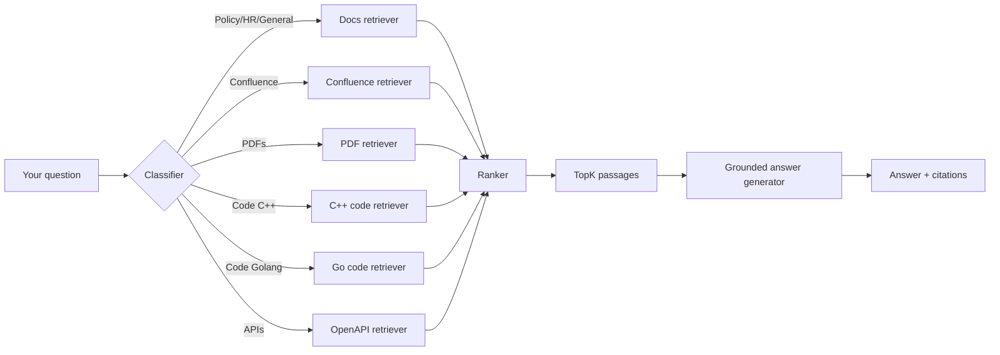

# Redge Media Origin & Coder RAG (Retrieval-Augmented Generation)

> **Goal:** help you understand what RAG is, what sources it can use, how to ask good questions, and how to add or fix content.

---

## 1) What is RAG?

RAG (Retrieval‑Augmented Generation) is a pattern where an AI model answers questions using *recent, company‑specific* information pulled from approved sources ("retrieval"). The model does **not** rely solely on its pre‑training; it grounds its answers in the retrieved passages and snippets, which are shown to you for transparency.

**Benefits**

* Up‑to‑date answers without retraining the model
* Fewer hallucinations by citing real documents
* Consistent answers across teams and systems
* Extended information security by using internal AI tools

---

## 2) What does our RAG system use?

Our instance is connected to several sources. Each has its own retriever tuned for that source:

* **Product & engineering Markdown docs**
* **Confluence**
* **PDFs**
* **Codebase – C++**
* **Codebase – Go** (Underway)
* **OpenAPI specs**

---

## 3) How it works (Agentic High Level)

**Under the hood**

* *Chunking & embeddings:* each source is split into semantically meaningful chunks (e.g., sections; for code: classes/methods; for OpenAPI: endpoints & schemas) and vectorized for fast similarity search.
* *Hybrid search:* lexical + vector search improves precision on code and API names.
* *Ranking:* a cross‑encoder re‑ranks candidates before generation.
* *Grounded generation:* the model is constrained to only use retrieved snippets; citations are shown.

---

## 4) Architecture (deeper dive)

* **Ingestion**: scheduled sync jobs pull from repos/spaces; content is normalized to a common schema.
* **Parsing**: per‑source parsers (Docs, Confluence, PDF, C++/Go via tree‑sitter, OpenAPI) produce structured chunks.
* **Indexing**: embeddings + BM42; metadata includes source, path, title, timestamps and other.
* **Query pipeline**: query classifier → source routers → retrievers → re‑rank → grounded generation.
* **Observability**: metrics on retrieval precision/latency.

---

## 5) Getting access

* RAG UI: **https://chat.redgelabs.com/**

> For access or issues: **@dum-zos**

