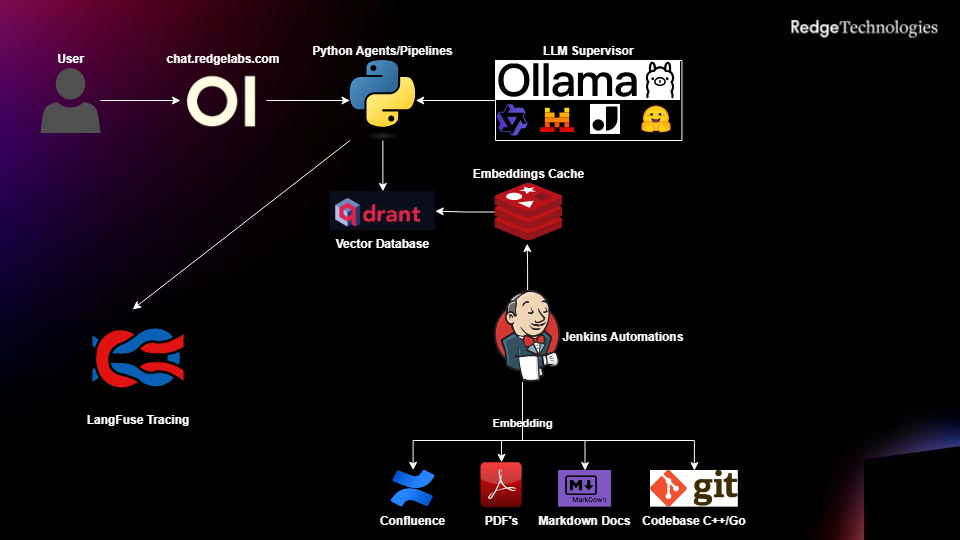

# 🛠️ Ops Inventory


## High Level Architecture diagram



---

## 1. Conventions

- **Environment:** `dev`
- **Code repository:** [chat-ai-deployment](https://drm-gitlab.redlabs.pl/zos/chat-ai-deployment)
- **Embedding source repository:** [chat-ai-embedding-sources](https://drm-gitlab.redlabs.pl/zos/chat-ai-embedding-sources)

---

## 2. Inventory Overview

### 2.1 CI/CD

| Name    | Purpose  | Env          | Public URL                      |
|---------|----------|--------------|---------------------------------|
| Jenkins | General  | dev/uat/prod | https://zos-jenkins.redlabs.pl/ |

---

### 2.2 Databases & State

| Name                | Purpose                         | Env | Host/IP       | Port | Public URL                                       |
|---------------------|---------------------------------|----:|---------------|-----:|:-------------------------------------------------|
| Qdrant              | Embeddings Vector Database      | dev | 10.255.240.18 | 6333 | http://10.255.240.18:6333/dashboard#/collections |
| Redis Insight (GUI) | Embeddings Cache User Interface | dev | 10.255.240.18 | 5540 | http://10.255.240.18:5540/                       |
| Redis Database      | Embeddings Cache                | dev | 10.255.240.18 | 6379 | -                                                |

#### 🚀 Deployment

**Qdrant**  <br/>
Repository: [gitlab](https://drm-gitlab.redlabs.pl/zos/chat-ai-deployment/-/tree/master/qdrant)  <br/>
Host: `10.255.240.18`    <br/>
User: `redge`    <br/>

```bash
cd /opt/ai/qdrant && docker-compose up -d
````

**Redis**  <br/>
Repository: [gitlab](https://drm-gitlab.redlabs.pl/zos/chat-ai-deployment/-/blob/master/cache)  <br/>
Host: `10.255.240.18`  <br/>
User: `redge`  <br/>

```bash
cd /opt/ai/redis && docker-compose up -d
```

---

### 2.3 Core Services

| Name                | Purpose                      | Env | Host/IP        | Port   | Public URL                                                                                 |
|---------------------|------------------------------|----:|----------------|--------|--------------------------------------------------------------------------------------------|
| OpenWebUI GUI       | GPT-like Graphical Interface | dev | 10.255.240.156 | 80/443 | [https://chat.redgelabs.com/](https://chat.redgelabs.com/)                                 |
| OpenWebUI Pipelines | Main RAG processing logic    | dev | 10.255.240.156 | 9099   | [http://10.255.240.156:9099/chat/completions](http://10.255.240.156:9099/chat/completions) |
| Searxng             | Web Search for LLM           | dev | 10.255.240.156 | 8006   | [http://10.255.240.156:8006/search?q=](http://10.255.240.156:8006/search?q=)               |


#### 🚀 Deployment

**GUI**  <br/>
Repository: [gitlab](https://drm-gitlab.redlabs.pl/zos/chat-ai-deployment/-/tree/master/openwebui)  <br/>
Host: `10.255.240.156`    <br/>
User: `atds`    <br/>

```bash
cd /opt/chat-ai-deployment/openwebui && git pull && docker-compose -f docker-compose.yaml up -d
````

**Pipelines**  <br/>
Repository: [gitlab](https://drm-gitlab.redlabs.pl/zos/chat-ai-deployment/-/blob/master/pipelines)  <br/>
Host: `10.255.240.156`  <br/>
User: `atds`  <br/>

```bash
cd /opt/chat-ai-deployment/pipelines && git pull && docker-compose up -d --build
```

**Searxng**  <br/>
Repository: [gitlab](https://drm-gitlab.redlabs.pl/zos/chat-ai-deployment/-/blob/master/searxng)  <br/>
Host: `10.255.240.156`  <br/>
User: `atds`  <br/>

```bash
cd /opt/chat-ai-deployment/searxng && git pull && docker-compose up -d
```


---

### 2.4 LLM Serving

| Model                               | Purpose   | Runtime | Env | Host/IP        |  Port | Endpoint               |
|-------------------------------------|-----------|---------|----:|----------------|------:|------------------------|
| `qwen3:30b`                         | General   | Ollama  | dev | 10.255.240.156 | 11434 | `/v1/chat/completions` |
| `qwen3-coder:30b`                   | General   | Ollama  | dev | 10.255.240.156 | 11434 | `/v1/chat/completions` |
| `qwen3:4b-instruct`                 | Oracle    | Ollama  | dev | 10.255.240.151 | 11434 | `/v1/chat/completions` |
| `gte-qwen2.5-instruct-q5`           | Embedding | Ollama  | dev | 10.255.246.131 | 11434 | `/embeddings`          |
| `jina-embeddings-v2-base-en:latest` | Embedding | Ollama  | dev | 10.255.246.131 | 11435 | `/embeddings`          |

> ⚠️ **Important**
> Model availability depends on system resources. For the current state, contact **@dum-zos**.

#### 🚀 Deployment

**Ollama General**

```bash
ollama serve <model_name>
```

**Embedder (gte-qwen2.5-instruct-q5)**  <br/>
Repository: [gitlab](https://drm-gitlab.redlabs.pl/zos/chat-ai-deployment/-/blob/master/embedder)  <br/>
Host: `10.255.246.131`  <br/>
User: `atds`  <br/>

```bash
cd /opt/chat-ai-deployment/embedder && git pull && docker-compose -f docker-compose-balancer.yaml up -d
```

**Embedder (jina-embeddings-v2-base-en:latest)**  <br/>
Repository: [gitlab](https://drm-gitlab.redlabs.pl/zos/chat-ai-deployment/-/blob/master/embedder/jina)  <br/>
Host: `10.255.246.131`  <br/>
User: `atds`  <br/>

```bash
cd /opt/chat-ai-deployment/embedder/jina && git pull && docker-compose up -d
```

---

### 2.5 Agents

| Name                   | Purpose                                 | Env | Host/IP        | Port | Public URL                                                                                 |
|------------------------|-----------------------------------------|----:|----------------|------|--------------------------------------------------------------------------------------------|
| Multiagent Endpoint    | Agentic Mesh Access Point               | dev | 10.255.246.131 | 5000 | [http://10.255.246.131:5000](http://10.255.246.131:5000)                                   |
| Oracle                 | Tool Agents Usage Decision Maker        | dev | 10.255.246.131 | 5001 | [http://10.255.246.131:5001/chat/completions](http://10.255.246.131:5001/chat/completions) |
| Final Answer           | Answer Ensure and Summary               | dev | 10.255.246.131 | 5004 | [http://10.255.246.131:5004/chat/completions](http://10.255.246.131:5004/chat/completions) |
| Software Developer     | C++/Golang Software Developer           | dev | 10.255.246.131 | 5003 | [http://10.255.246.131:5003/chat/completions](http://10.255.246.131:5003/chat/completions) |
| OTT Specialist         | Redge Business Solutions Specialist     | dev | 10.255.246.131 | 5002 | [http://10.255.246.131:5002/chat/completions](http://10.255.246.131:5002/chat/completions) |
| OpenAPI Specialist     | OpenAPI Specialist (Underway)           | dev | n/a            | n/a  | n/a                                                                                        |
| NetOps Specialist      | DUM-ZRS Resources Specialist (Underway) | dev | n/a            | n/a  | n/a                                                                                        |
| Code Review Specialist | AI Code Reviewer (Underway)             | dev | n/a            | n/a  | n/a                                                                                        |

#### 🚀 Deployment

**Agents**  <br/>
Repository: [gitlab](https://drm-gitlab.redlabs.pl/zos/chat-ai-deployment/-/blob/master/agents)  <br/>
Host: `10.255.246.131`  <br/>
User: `atds`  <br/>

```bash
cd /opt/chat-ai-deployment/agents && git pull && docker-compose up -d --force-recreate --build
```

---

### 2.6 Utilities & Observability

| Name     | Type               | Env | Host/IP        | Port | URL                                                        |
|----------|--------------------|----:|----------------|------|------------------------------------------------------------|
| Langfuse | Monitoring/Tracing | dev | 10.255.240.149 | 3000 | [http://10.255.240.149:3000/](http://10.255.240.149:3000/) |

#### 🚀 Deployment

**Langfuse**  <br/>
Repository: [gitlab](https://drm-gitlab.redlabs.pl/zos/chat-ai-deployment/-/blob/master/langfuse)  <br/>
Host: `10.255.240.149`  <br/>
User: `atds`  <br/>

```bash
cd /opt/chat-ai-deployment/langfuse && git pull && docker-compose up -d
```


