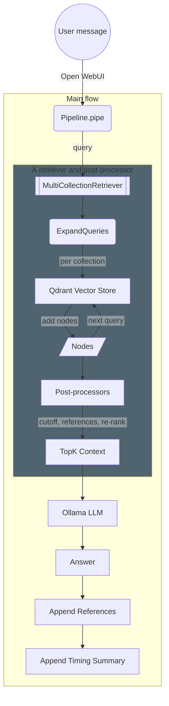
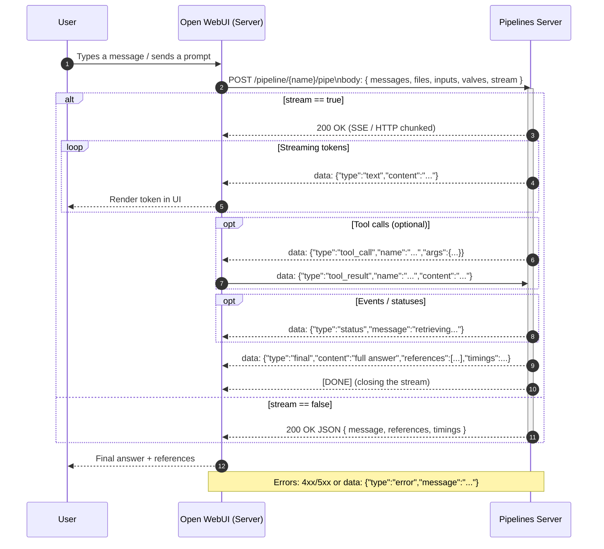
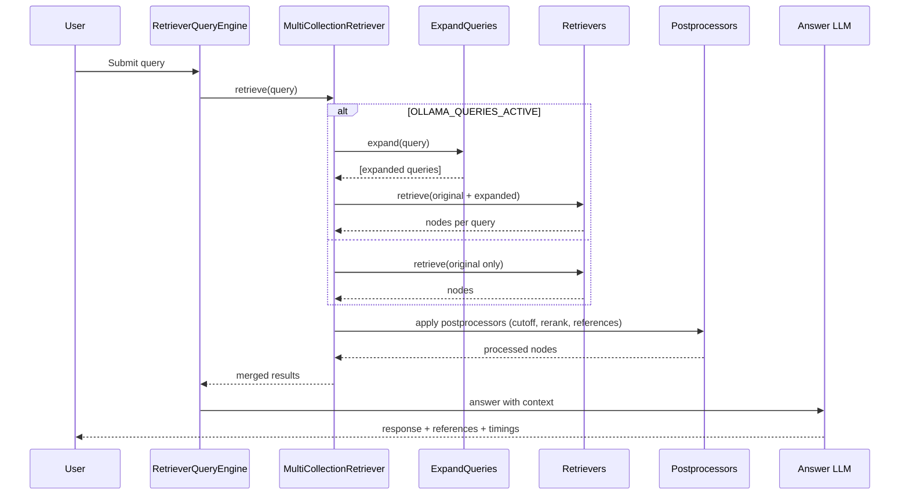
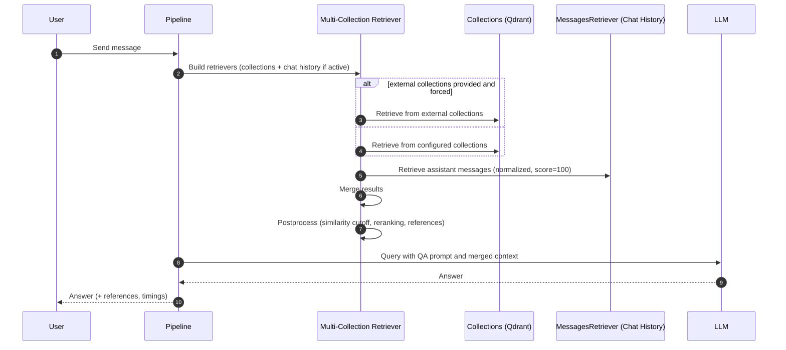

# Assistant Redge

A production Open WebUI pipeline that answers questions using company knowledge stored in Qdrant. It uses LlamaIndex to retrieve and re-rank passages from multiple collections, then generates a grounded answer with an Ollama-hosted LLM. The pipeline also appends transparent references and timing info to each response.

Repository source: chat-ai-deployment/pipelines/prod/pipelineRedgeAssistant.py

Useful references:
- Open WebUI Pipelines docs: https://docs.openwebui.com/pipelines/
- Open WebUI Pipelines repository: https://github.com/open-webui/pipelines

---

## What it does

- Retrieves relevant chunks from one or more Qdrant collections (hybrid: dense + sparse optional).
- Re-ranks results (Cross-Encoder and/or LLM-based, configurable).
- Generates an answer with a domain-tuned prompt and an Ollama-served LLM.
- Streams tokens if requested, then appends a References section and an execution summary.
- Can use chat history as an additional retrieval source.

---

## High-level flow



---

## Sequence diagram: Open WebUI ↔ Pipelines Server

The following sequence diagram (mermaid) shows a typical exchange between the Open WebUI server and the Pipelines server when calling a pipe endpoint, including response streaming and optional tool calls. Based on [documentation](https://docs.openwebui.com/pipelines/)



---

## Key parts

- Retriever stack
  - [`QdrantVectorStore`](https://developers.llamaindex.ai/python/framework-api-reference/storage/vector_store/qdrant/#llama_index.vector_stores.qdrant.QdrantVectorStore) per collection.
  - [`MultiCollectionRetriever`](/documentation/ai-solutions/pipelines/tools/#multicollectionretriever) aggregates results from multiple collections.
  - Optional [`MessagesRetriever`](/documentation/ai-solutions/pipelines/tools/#messagesretriever) uses prior chat messages as context documents.
- Post-processors
  - [`SimilarityCutoffPostprocessor`](/documentation/ai-solutions/pipelines/tools/#similaritycutoffpostprocessor): drops low-score hits.
  - [`SentenceTransformerRerank`](https://developers.llamaindex.ai/python/framework-api-reference/postprocessor/sbert_rerank/?h=sentencetransformerrerank#llama_index.postprocessor.sbert_rerank.SentenceTransformerRerank): cross-encoder reranking (default: cross-encoder/ms-marco-MiniLM-L-6-v2).
  - [`LLMRerank`](https://developers.llamaindex.ai/python/framework-api-reference/postprocessor/llm_rerank/?h=llmrerank#llama_index.core.postprocessor.LLMRerank): LLM selection with a specialized CHOICE_SELECT prompt.
  - [`BuildReference`](/documentation/ai-solutions/pipelines/tools/#buildreference): builds human-readable references from node metadata (PDF, HTML, Docusaurus, etc.).
- Generator
  - Ollama LLM for final grounded answer.
  - Optional streaming (Open WebUI style). When streaming is enabled, the pipeline streams tokens, then appends references and timing as final chunks.

---

## Configuration (Valves)

The pipeline exposes [`Valves`](https://docs.openwebui.com/pipelines/valves/) (dynamic config in Open WebUI).

Defaults in code are shown in parentheses.

| Name                                | Description                                                                 | Default Value                                                           |
|-------------------------------------|-----------------------------------------------------------------------------|-------------------------------------------------------------------------|
| OLLAMA_MODEL_BASE_URL               | Base URL for the Ollama model.                                              | `http://10.255.240.156:11434`                                           |
| OLLAMA_MODEL_NAME                   | Name of the Ollama model to use.                                            | `qwen3:30b`                                                             |
| OLLAMA_CONTEXT_WINDOW               | Context window size for the Ollama model.                                   | `61440`                                                                 |
| OLLAMA_TEMPERATURE                  | Temperature parameter for controlling randomness in generated text.         | `0.5`                                                                   |
| OLLAMA_EMBEDDING_BASE_URL           | Base URL for the Ollama embedding model.                                    | `http://10.255.246.131:11434`                                           |
| OLLAMA_EMBEDDING_MODEL_NAME         | Name of the Ollama embedding model to use.                                  | `gte-qwen2.5-instruct-q5`                                               |
| OLLAMA_CHUNK_SIZE                   | Size of text chunks for embeddings.                                         | `1024`                                                                  |
| OLLAMA_CHUNK_OVERLAP                | Overlap between text chunks for embeddings.                                 | `256`                                                                   |
| OLLAMA_RERANK_ACTIVE                | Flag to activate Ollama-based re-ranking.                                   | `True`                                                                  |
| OLLAMA_RERANK_BASE_URL              | Base URL for the Ollama model used in re-ranking.                           | `http://10.255.240.156:11434`                                           |
| OLLAMA_RERANK_MODEL_NAME            | Name of the Ollama model to use in re-ranking.                              | `llama3.2:3b`                                                           |
| OLLAMA_RERANK_TEMPERATURE           | Temperature parameter for controlling randomness in re-ranked text.         | `0.5`                                                                   |
| OLLAMA_RERANK_TOP_N                 | Number of top results to keep after Ollama-based re-ranking.                | `10`                                                                    |
| OLLAMA_RERANK_CHOICE_BATCH_SIZE     | Batch size for choice selection during re-ranking.                          | `5`                                                                     |
| SENTENCE_TRANSFORMER_RERANK_ACTIVE  | Flag to activate sentence transformer-based re-ranking.                     | `True`                                                                  |
| SENTENCE_TRANSFORMER_RERANK_MODEL   | Name of the sentence transformer model to use in re-ranking.                | `cross-encoder/ms-marco-MiniLM-L-6-v2`                                  |
| SENTENCE_TRANSFORMER_RERANK_TOP_N   | Number of top results to keep after sentence transformer-based re-ranking.  | `10`                                                                    |
| QDRANT_BASE_URL                     | Base URL for the Qdrant vector store.                                       | `http://10.255.240.18:6333`                                             |
| QDRANT_COLLECTION_NAME              | Comma-separated list of collection names in Qdrant.                         | `confluence_prod_bm42`,<br/>`docusaurus_prod_bm42`,<br/>`pdf_prod_bm42` |
| QDRANT_VECTOR_STORE_PARALLEL        | Number of parallel vector store operations.                                 | `4`                                                                     |
| QDRANT_SIMILARITY_TOP_K             | Top K results to fetch from each collection before post-processing.         | `7`                                                                     |
| QDRANT_HYBRID_SEARCH                | Flag to enable hybrid search using sparse encoder.                          | `True`                                                                  |
| QDRANT_SIMILARITY_CUTOFF_ACTIVE     | Flag to activate similarity score cutoff.                                   | `True`                                                                  |
| QDRANT_SIMILARITY_CUTOFF            | Similarity score threshold for filtering results.                           | `0.5`                                                                   |
| CHAT_HISTORY_ACTIVE                 | Flag to activate chat history as an additional retrieval source.            | `True`                                                                  |
| FORCE_ONLY_EXTERNAL_SOURCES         | Flag to ignore default collections when external collections are provided.  | `True`                                                                  |
| PIPELINE_TIME_RECORDING             | Flag to govern timing via Observer.                                         | `True`                                                                  |
| SPARSE_TEXT_EMBEDDING_MODEL         | Name of the sparse text embedding model used when hybrid search is enabled. | `prithivida/Splade_PP_en_v1`                                            |
| OLLAMA_QUERIES_ACTIVE               | Flag to activate Ollama queries.                                            | `True`                                                                  |
| OLLAMA_QUERIES_BASE_URL             | Base URL for the Ollama queries model.                                      | `http://10.255.240.161:11434`                                           |
| OLLAMA_QUERIES_MODEL_NAME           | Name of the Ollama queries model to use.                                    | `mistral`                                                               |
| OLLAMA_QUERIES_STRATEGY             | Strategy for Ollama queries.                                                | `diversify`                                                             |
| OLLAMA_QUERIES_SIMILARITY_THRESHOLD | Similarity threshold for Ollama queries.                                    | `0.8`                                                                   |
| OLLAMA_QUERIES_TEMPERATURE          | Temperature parameter for controlling randomness in Ollama queries.         | `0.5`                                                                   |
| OLLAMA_QUERIES_NUM                  | Number of Ollama queries to run.                                            | `3`                                                                     |
| OLLAMA_QUERIES_CONTEXT_WINDOW       | Context window size for Ollama queries.                                     | `8192`                                                                  |
| OLLAMA_QUERIES_MIN_QUERY_LENGTH     | Minimum query length for Ollama queries.                                    | `32`                                                                    |
| OLLAMA_QUERIES_MAX_QUERY_LENGTH     | Maximum query length for Ollama queries.                                    | `256`                                                                   |

Notes
- Env var names are the valve names suffixed with `_ASSISTANT_REDGE` (e.g., `QDRANT_BASE_URL_ASSISTANT_REDGE`).
- Request timeout defaults are handled in code. The context window also configures a reranker window for the LLM reranker.

---

## How retrieval works

- Collections: `QDRANT_COLLECTION_NAME` can be a comma-separated list. Each is opened as a separate retriever.
- Hybrid search: If `QDRANT_HYBRID_SEARCH` is True, the pipeline uses a sparse encoder (default SPLADE) for both doc and query, enabling [BM42-style](https://qdrant.tech/articles/bm42/) hybrid search in Qdrant.
- Top K: `QDRANT_SIMILARITY_TOP_K` controls how many candidates per retriever are kept before post-processing.
- Routing: All retrievers feed results into [`MultiCollectionRetriever`](/documentation/ai-solutions/pipelines/tools/#multicollectionretriever), which merges and applies node post-processors.
- Chat history: If `CHAT_HISTORY_ACTIVE` is True and there is a prior conversation, [`MessagesRetriever`](/documentation/ai-solutions/pipelines/tools/#messagesretriever) adds those turns as additional retrieval context.

---

## Generation and streaming

- `Prompt`: The QA prompt is specialized for multimedia streaming/networking topics (codecs, containers, HLS/DASH/SS, RTMP/MPEG-TS, CUDA/NVENC, etc.). The model is instructed to be precise, grounded, and to decline when the context is not enough.
- `Streaming`: If the request sets stream=true, the pipeline returns a generator; tokens are streamed first. After the model stops, it emits:
  - a `References` section listing unique sources with retrieval scores, and
  - a timing summary produced by the Observer.

---

## References in the answer

At the end of each response, the pipeline appends:

- `References`: Built from node metadata (PDF, HTML, Docusaurus, etc.), deduplicated and sorted by score. Example entry: "- Confluence: Page Title (Score: 0.87)".
- `Summary`: Timing and counts (retrieval and generation), produced by the Observer.

---

## Expanded queries

### What it is
Expanded queries generate additional, semantically related questions from the user’s original prompt to improve recall during retrieval. These expansions are deduplicated, quality-checked, and then used alongside the original query to search multiple collections. Results are merged, post-processed, and then answered by the LLM.

### When it’s active
Controlled by `OLLAMA_QUERIES_ACTIVE`. If true, the pipeline constructs an [`ExpandQueries`](/documentation/ai-solutions/pipelines/tools/#query-expansion) helper and uses it inside the [`MultiCollectionRetriever`](/documentation/ai-solutions/pipelines/tools/#multicollectionretriever).

### How it works (high-level)
- Receive user query.
- If Expanded queries are active, generate N expansions via a dedicated Ollama LLM endpoint.
- Parse, validate (length, content), and deduplicate expanded questions (word-overlap similarity).
- Combine original + expanded queries.
- Retrieve from all configured collections for each query.
- Merge results, apply postprocessors (e.g., SimilarityCutoff, rerankers, references).
- Answer with the main LLM; include references and timing summary.

### How to configure expanded queries:

By default, the expand query mechanism is enabled and runs in the “diversify” mode. To disable it, set `OLLAMA_QUERIES_ACTIVE` to `False` in the OpenWeb UI settings.
You can further configure alternative queries in OpenWeb UI: `Admin Panel > Settings > Pipelines > Pipelines Valves > pipelineRedgeAssistant (pipe)`, with the following options available:
- Enable/disable: `OLLAMA_QUERIES_ACTIVE` (_Ollama Queries Active_)
- Strategy: `OLLAMA_QUERIES_STRATEGY` (_Ollama Queries Strategy_)
  - Possible [strategies](/documentation/ai-solutions/pipelines/tools/#strategies): `diversify`, `specify`, `broaden`, `rephrase`, `diagnose`
- Alternative generation model: `OLLAMA_QUERIES_MODEL_NAME` (_Ollama Queries Model Name_)
- Generated queries properties:
  - Number of queries: `OLLAMA_QUERIES_NUM` (_Ollama Queries Num_)
  - Diversity parameters:
    - `OLLAMA_QUERIES_SIMILARITY_THRESHOLD` (_Ollama Queries Similarity Threshold_)
    - `OLLAMA_QUERIES_TEMPERATURE` (_Ollama Queries Temperature_)
  - Minimum/maximum length:
    - `OLLAMA_QUERIES_MIN_QUERY_LENGTH` (_Ollama Queries Min Query Length_)
    - `OLLAMA_QUERIES_MAX_QUERY_LENGTH` (_Ollama Queries Max Query Length_)

### Sequence diagram:

### Examples of expanded queries:

- User message: `What is the fragment duration in DASH?`
- Expanded queries:
  - `diversify`:
    - What are the key factors affecting the choice of fragment duration in DASH, and how do they impact the trade-off between start-up time, buffering delay, and network utilization? 
    - In what ways can the performance of a DASH streaming system be optimized when using CUDA or NVENC for encoding? Are there any potential bottlenecks or edge cases to consider during implementation?
    - How does the interoperability between different DASH implementations (e.g., Apple HLS, Adobe HDS) affect the choice of fragment duration and what strategies can be employed to ensure seamless content delivery in heterogeneous environments?
  - `specify`:
    - What is the recommended fragment duration for DASH when optimizing for low-latency streaming and how does it impact buffer management in the player?
    - In an implementation using FFmpeg for encoding/decoding, what are some best practices when it comes to setting codec flags and hardware acceleration behavior for efficient fragment handling in DASH-based streaming?
    - Can you elaborate on how to optimize the fragment duration during dynamic image generation, considering the trade-off between quality, latency, and bandwidth usage in a system like Redge Media Coder?
  - `broaden`:
    - What are the current trends in video encoding technologies, particularly the comparison between H.264, H.265, and emerging codecs, and their impact on fragment duration in DASH?
    - How does the adoption of new streaming protocols like MPEG-DASH 2.0 or CMAF affect the fragmentation strategy in a DASH system, and what considerations should be made for network scalability and cross-platform compatibility?
    - When considering hardware/software trade-offs for deployment, how does the choice between software-based and hardware-accelerated solutions impact the performance, efficiency, and overall fragment duration in DASH implementations?
  - `rephrase`:
    - What is the segment length in Dynamic Adaptive Streaming over HTTP (DASH)?
    - In the context of MPEG Dynamic Adaptive Streaming over HTTP (DASH), what is the duration of each media fragment or segment?
    - What is the time period for each chunk or piece of content in a DASH stream?
  - `diagnose`:
    - Is there any deviation from the specified `segmentDuration` at runtime due to dynamic adaptive streaming protocol (DASP) or other factors affecting segment generation?
    - Are there any logs or metrics suggesting issues with segment playback, such as buffering delays, dropped segments, or inconsistencies in the bitrate of the delivered content?
    - Is there any variation in the segment duration across different segments within a single manifest? If so, what factors might be causing this inconsistency?


---

## Using external collections

You can add external Qdrant collections on a per-request basis. The pipeline recognizes the following formats in the
request body:

- **Generated by Open WebUI**: If the user employs features like “Search the Internet” or “Upload Files,” the content
  will be processed and stored temporarily in a collection within Qdrant.
- **Direct**: The name of the collection within a given chat session is passed to the pipeline via the
  `external_collections` field, formatted as `open-webui_UUID`.
- **From file metadata**: During processing, the pipeline dynamically attaches the collection by retrieving the
  collection name from either `files[].collection_name` (new) or `metadata.files.collection_name` (old).
The `inlet()` hook maps any file’s collection_name into external_collections as `open-webui_UUID`. If `FORCE_ONLY_EXTERNAL_SOURCES` is True, the default collections are ignored and only external collections are used for that request.

Example request body fragment (Open WebUI compatible):

```json
{
  "messages": [
    {"role": "user", "content": "What is the fragment duration in DASH?"}
  ],
  "stream": true,
  "metadata": {
    "files": [
      {"collection_name": "open-webui_UUID"}
    ]
  }
}
```

---
## Chat history

When CHAT_HISTORY_ACTIVE is enabled, previous assistant messages are injected into retrieval to improve context and continuity of answers.
- What is included:
  - Only prior messages with role=assistant from the current conversation.
  - Each included assistant message is normalized (Markdown artifacts like “References” and “Times” sections are stripped; content is converted to plain text).
  - They are treated as highly relevant context (scored at 100) and passed to the retriever alongside document chunks.
- How it is used:
  - The chat-history nodes are merged with results from configured collections (and any external collections selected for the request).
  - Standard post-processing (similarity cutoff, reranking, references building) still applies to the combined set.
  - This helps the model stay consistent with its prior responses, enabling follow-ups and refinements without restating all details.
- When it activates:
  - Active only if `CHAT_HISTORY_ACTIVE` is true and the conversation has more than one message.
- Notes:
  - User messages are not embedded into retrieval; only assistant messages are.
  - If external_collections are provided and `FORCE_ONLY_EXTERNAL_SOURCES` is true, internal collections are temporarily ignored, but chat history still participates in retrieval.


---
## Integration points with Open WebUI pipelines

- Class name: Pipeline
- Lifecycle:
  - `on_startup()`: loads config and builds retrievers
  - `on_valves_updated()`: reloads config when valves change in UI
  - `on_shutdown()`: closes Qdrant client
- Hooks:
  - `inlet(body, user)`: mutates request (maps `files[].collection_name` to `external_collections`)
  - `outlet(body, user)`: mutates response (replaces "Empty Response" with a helpful message)
- Main entry:
  - `pipe(user_message, model_id, messages, body)`: performs retrieval, re-ranking, and generation; returns a string or a streaming generator

Refer to Open WebUI pipelines documentation for how to enable and manage valves and how the pipeline lifecycle hooks are invoked: https://docs.openwebui.com/pipelines/

---

## Prerequisites

- Qdrant reachable at the configured QDRANT_BASE_URL with populated collections.
- Ollama servers for:
  - Embeddings (`OLLAMA_EMBEDDING_BASE_URL` + `OLLAMA_EMBEDDING_MODEL_NAME`)
  - Generation (`OLLAMA_MODEL_BASE_URL` + `OLLAMA_MODEL_NAME`)
  - Optional LLM reranker (`OLLAMA_RERANK_BASE_URL` + `OLLAMA_RERANK_MODEL_NAME`)

---

## Operational tips

- Start with hybrid search on for better recall on exact names (APIs, identifiers).
- Use SentenceTransformer rerank for precision; enable LLM rerank only when needed (it’s costlier but can improve relevance).
- Tune `QDRANT_SIMILARITY_TOP_K` and cut-off based-on-latency and quality targets.
- Provide narrow external_collections per request for focused answers (and optionally set `FORCE_ONLY_EXTERNAL_SOURCES`=`True`).

---

## Troubleshooting

- Empty Response: The outlet() hook converts this into a friendly message; if you often see this, widen recall (increase TOP_K, relax cutoff) or ensure the right collections are used.
- Timeouts: Ensure `DEFAULT_REQUEST_TIMEOUT` (code-level) and Ollama endpoints are reachable and resourced.
- Hybrid search is not taking effect: Verify `QDRANT_HYBRID_SEARCH`=`True` and `SPARSE_TEXT_EMBEDDING_MODEL` is valid (default: `prithivida/Splade_PP_en_v1`).
- Missing references: Ensure BuildReference recognizes your metadata schema; non-standard sources may need parser updates.
