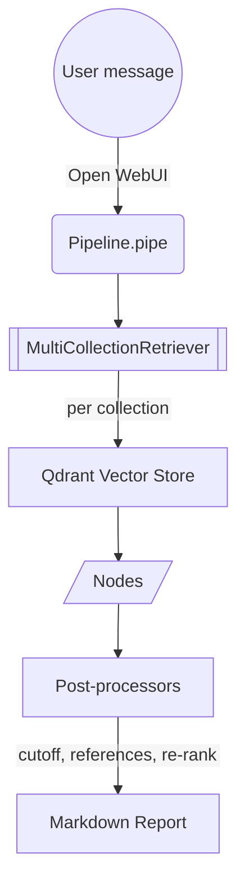

# Qdrant Retriever

A diagnostic Open WebUI pipeline that shows exactly which document fragments would be fed to an LLM as retrieval context. It performs the same multi-collection search and post‑processing stack used by Assistant Redge, but instead of generating an answer, it returns a human‑readable report of the retrieved nodes (IDs, scores, metadata, and text) plus a timing summary.

Repository source: chat-ai-deployment/pipelines/prod/pipelineQdrantRetriever.py

Useful references:
- Open WebUI Pipelines docs: https://docs.openwebui.com/pipelines/
- Open WebUI Pipelines repository: https://github.com/open-webui/pipelines

---

## What it’s for

- Verify which fragments (chunks) are selected for a given query before they would be passed into an LLM.
- Debug retrieval quality across multiple Qdrant collections.
- Inspect scores, metadata, and normalized references after post‑processing (cutoff, cross‑encoder/LLM reranking).

This is the fastest way to understand “why did the assistant answer like that?”—by inspecting the exact context it would have seen.

---

## High‑level flow



---

## Key parts

- Multi‑collection retrieval
  - One [`QdrantVectorStore`](https://developers.llamaindex.ai/python/framework-api-reference/storage/vector_store/qdrant/#llama_index.vector_stores.qdrant.QdrantVectorStore) retriever per collection.
  - [`MultiCollectionRetriever`](/documentation/ai-solutions/pipelines/tools/#multicollectionretriever) merges results from all configured collections.
- Post‑processors
  - [`SimilarityCutoffPostprocessor`](/documentation/ai-solutions/pipelines/tools/#similaritycutoffpostprocessor): drops low‑score hits early.
  - [`SentenceTransformerRerank`](https://developers.llamaindex.ai/python/framework-api-reference/postprocessor/sbert_rerank/?h=sentencetransformerrerank#llama_index.postprocessor.sbert_rerank.SentenceTransformerRerank) (optional): cross‑encoder reranking for precision.
  - [`LLMRerank`](https://developers.llamaindex.ai/python/framework-api-reference/postprocessor/llm_rerank/?h=llmrerank#llama_index.core.postprocessor.LLMRerank) (optional): LLM choice selection with a `CHOICE_SELECT` prompt.
  - [`BuildReference`](/documentation/ai-solutions/pipelines/tools/#buildreference): enriches nodes with human‑readable references from metadata (PDF, HTML, Docusaurus, etc.).
- Output
  - A Markdown report listing, for each node: ID, score, metadata, and the chunk text; followed by a timing summary from an [`Observer`](/documentation/ai-solutions/pipelines/tools/#observer).

---

## How retrieval works

- Collections: `QDRANT_COLLECTION_NAME` is a comma‑separated list. Each name is opened as its own retriever.
- Hybrid search: If `QDRANT_HYBRID_SEARCH` is True, a sparse encoder is used for both documents and queries, enabling dense+sparse hybrid retrieval in Qdrant.
- Top‑K: `QDRANT_SIMILARITY_TOP_K` limits candidates per retriever before post‑processing.
- Merging and post‑processing: [`MultiCollectionRetriever`](/documentation/ai-solutions/pipelines/tools/#multicollectionretriever) pulls from every active retriever, then applies post‑processors in order (cutoff → rerankers → reference builder).

---

## Configuration (Valves)

Valves are dynamic settings exposed in Open WebUI. They map to environment variables with the suffix `_QDRANT_RETRIEVER`, e.g., `QDRANT_BASE_URL_QDRANT_RETRIEVER`.

Defaults below reflect what’s in code.

| Name                               | Description                                                                 | Default Value                                                           |
|------------------------------------|-----------------------------------------------------------------------------|-------------------------------------------------------------------------|
| OLLAMA_EMBEDDING_BASE_URL          | Base URL for the Ollama embedding model.                                    | `http://10.255.246.131:11434`                                           |
| OLLAMA_EMBEDDING_MODEL_NAME        | Name of the Ollama embedding model to use.                                  | `gte-qwen2.5-instruct-q5`                                               |
| OLLAMA_CHUNK_SIZE                  | Size of text chunks for embeddings.                                         | `1024`                                                                  |
| OLLAMA_CHUNK_OVERLAP               | Overlap between text chunks for embeddings.                                 | `256`                                                                   |
| OLLAMA_RERANK_ACTIVE               | Enable LLM‑based reranking via Ollama.                                      | `True`                                                                  |
| OLLAMA_RERANK_BASE_URL             | Base URL for the Ollama model used in reranking.                            | `http://10.255.240.156:11434`                                           |
| OLLAMA_RERANK_MODEL_NAME           | Name of the LLM for reranking.                                              | `llama3.2:3b`                                                           |
| OLLAMA_RERANK_TEMPERATURE          | Temperature for the reranking LLM.                                          | `0.5`                                                                   |
| OLLAMA_RERANK_TOP_N                | How many results to keep after LLM rerank.                                  | `10`                                                                    |
| OLLAMA_RERANK_CHOICE_BATCH_SIZE    | Batch size for CHOICE_SELECT prompt evaluation.                             | `5`                                                                     |
| QDRANT_BASE_URL                    | Base URL for the Qdrant vector store.                                       | `http://10.255.240.18:6333`                                             |
| QDRANT_COLLECTION_NAME             | Comma‑separated Qdrant collections.                                         | `confluence_prod_bm42`, `docusaurus_prod_bm42`, `pdf_prod_bm42`         |
| QDRANT_VECTOR_STORE_PARALLEL       | Parallel operations for Qdrant vector store.                                | `4`                                                                     |
| QDRANT_SIMILARITY_TOP_K            | Top K to retrieve from each collection.                                     | `7`                                                                     |
| QDRANT_HYBRID_SEARCH               | Enable dense+sparse hybrid search.                                          | `True`                                                                  |
| QDRANT_SIMILARITY_CUTOFF_ACTIVE    | Apply a similarity score cutoff.                                            | `True`                                                                  |
| QDRANT_SIMILARITY_CUTOFF           | Similarity threshold (0..1).                                                | `0.5`                                                                   |
| SENTENCE_TRANSFORMER_RERANK_ACTIVE | Enable cross‑encoder reranking.                                             | `True`                                                                  |
| SENTENCE_TRANSFORMER_RERANK_MODEL  | Cross‑encoder model for reranking.                                          | `cross-encoder/ms-marco-MiniLM-L-6-v2`                                  |
| SENTENCE_TRANSFORMER_RERANK_TOP_N  | How many results to keep after cross‑encoder rerank.                        | `10`                                                                    |
| PIPELINE_TIME_RECORDING            | If true, Observer captures timing and step info.                            | `True`                                                                  |
| SPARSE_TEXT_EMBEDDING_MODEL        | Sparse encoder model for hybrid retrieval.                                  | `prithivida/Splade_PP_en_v1`                                            |

Notes
- Env var names are the valve names suffixed with _`QDRANT_RETRIEVER` (e.g., `QDRANT_BASE_URL_QDRANT_RETRIEVER`).
- The reranking LLM uses a CHOICE_SELECT prompt template tuned for selecting relevant passages.

---

## Output format

The pipeline returns a Markdown report. For each retrieved node it prints:
- ID and score
- Metadata (source‑specific fields like url, file_path, token_count, etc.)
- The chunk text (wrapped for readability)

At the end, a timing summary is appended, e.g.:

```
---
**Times:**
- Retrieving from 'confluence_prod_bm42': 0.552 seconds.
- Retrieving from 'docusaurus_prod_bm42': 0.071 seconds.
- Retrieving from 'pdf_prod_bm42': 0.071 seconds.
- Postprocessing with 'SimilarityCutoffPostprocessor': 0.000 seconds.
- Postprocessing with 'SentenceTransformerRerank': 0.575 seconds.
```

This lets you correlate perceived quality with concrete steps, latencies, and post‑processors involved.

---

## Typical usage in Open WebUI

1) Select pipeline: "Qdrant Retriever".
2) Ask your question, e.g., "How do I configure HLS segment duration?".
3) Inspect the report: verify which sources and fragments were chosen, their scores, and the exact text the LLM would have received.

Tip: Run the same question with Assistant Redge afterward. Differences in the final answer often map directly to the difference you see in this report (e.g., cutoff too strict, TopK too low, rerankers off).

---

## Integration points

- Class name: Pipeline
- Lifecycle hooks:
  - `on_startup()`: loads config and builds per‑collection retrievers.
  - `on_valves_updated()`: reloads config when valves change in UI.
  - `on_shutdown()`: closes Qdrant client.
- Main entry:
  - `pipe(user_message, model_id, messages, body)`: performs retrieval and post‑processing; returns the Markdown report.

---

## Prerequisites

- Qdrant reachable at `QDRANT_BASE_URL` with populated collections.
- Ollama server for embeddings (`OLLAMA_EMBEDDING_BASE_URL` + `OLLAMA_EMBEDDING_MODEL_NAME`).
- Optional rerankers:
  - Cross‑encoder (`SENTENCE_TRANSFORMER_RERANK_MODEL`) available to the runtime.
  - Ollama LLM for reranking (`OLLAMA_RERANK_BASE_URL` + `OLLAMA_RERANK_MODEL_NAME`).

---

## Troubleshooting

- Empty or low‑quality results:
  - Increase `QDRANT_SIMILARITY_TOP_K`.
  - Relax `QDRANT_SIMILARITY_CUTOFF` or disable it.
  - Enable hybrid search for identifier‑heavy queries (`QDRANT_HYBRID_SEARCH`=True).
  - Ensure the right collections are listed in `QDRANT_COLLECTION_NAME`.
- Rerankers have no effect:
  - Verify `SENTENCE_TRANSFORMER_RERANK_ACTIVE`/`OLLAMA_RERANK_ACTIVE` are set appropriately.
  - Check model names/URLs.
- Slow responses:
  - Reduce TopK or disable some post‑processors.
  - Verify Qdrant and Ollama endpoints are healthy and sized for load.
